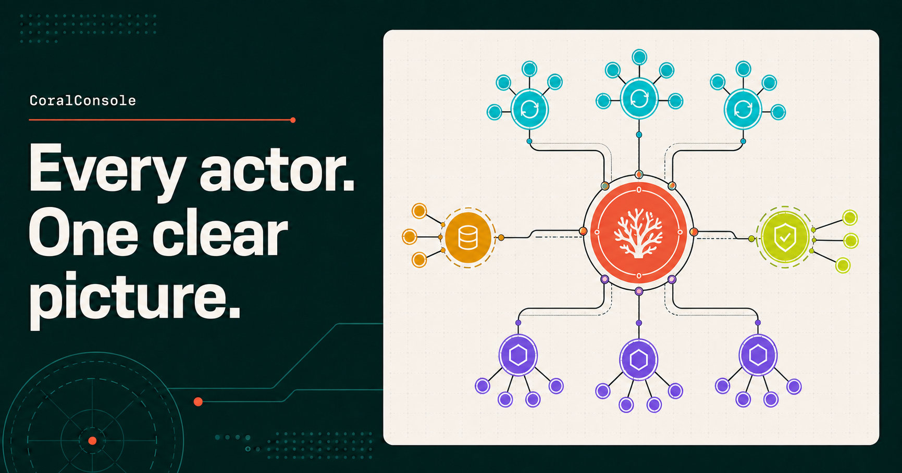
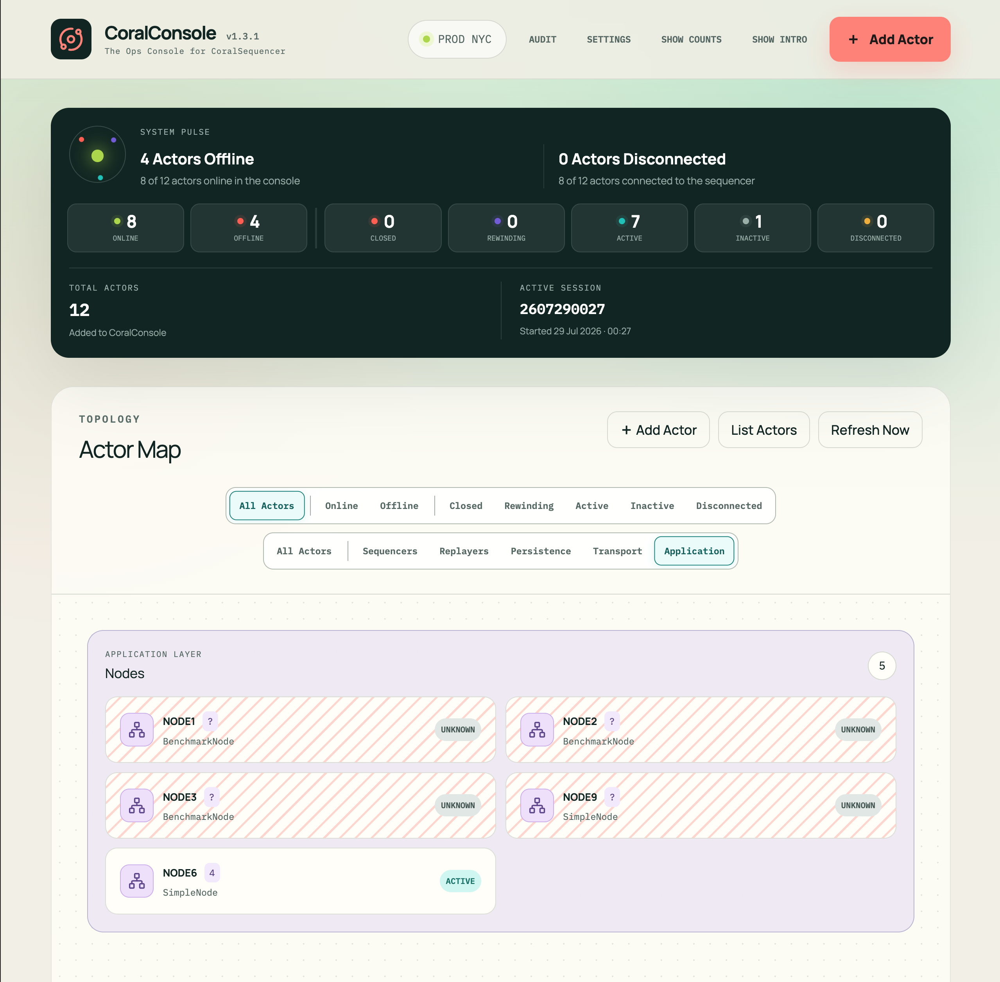

# CoralConsole

CoralConsole is a colorful operations console for discovering, organizing, and
administering actors in a
[CoralSequencer](https://www.coralblocks.com/coralsequencer) distributed system.
It gives operators one live view of every actor, its connectivity, operational
state, and available REST admin actions.





## Purpose

[CoralSequencer](https://www.coralblocks.com/coralsequencer) systems are composed of a
central Sequencer and surrounding actors such as Backup Sequencers, Replayers,
Archivers, Loggers, Bridges, Dispatchers, Nodes and Applications.
CoralConsole discovers those processes, organizes them by role, monitors them,
and provides a single place for operators to inspect and administer the
deployment.

## Features

- Live System Pulse with Online, Offline, Closed, Rewinding, Active, Inactive,
  and Disconnected counts.
- Filterable Actor Map organized by system layer and actor type.
- Automatic actor discovery from a host/IP address and REST admin port.
- Server-side monitoring that polls each actor with `actorStatus` and `list`
  over a dedicated persistent connection.
- One home-page browser refresh request retrieves current information for the
  complete topology, regardless of the number of actors.
- Dedicated actor pages with complete status fields and manual REST admin
  actions.
- Recent actor log messages update automatically on each Actor Detail page.
- Actor registry with endpoint editing, removal, and persisted precedence
  ordering within each actor type.
- Protected, searchable audit history for manual actions, including outcome,
  duration, output, timestamp, and requester IP address for accountability.
- Persistent topology settings, configurable polling, audit retention, and
  actor count visibility.
- Clear stale-interface warnings when the browser loses contact with the
  CoralConsole server.
- SQLite persistence, a verified backup script that runs without stopping
  CoralConsole, portable actor-only CSV transfer, and Docker deployment.

## How it works

The browser communicates only with the CoralConsole server. At each UI refresh
interval, the home page makes one HTTP request for the complete topology. It
never sends one request per actor and never contacts actor REST endpoints
directly.

Separately, the server monitors every actor at the configured actor polling
interval. For each actor, it calls `actorStatus` to update connectivity and
operational state, then `list` to update the available admin actions. These calls reuse
a dedicated persistent connection per actor.

The browser and server timers are independent, but server-side throttling
consolidates their work. A browser refresh receives the current stored topology
with fresh actor data. Multiple browser tabs do not multiply
actor polling.

When an actor is added, the server contacts its endpoint to discover its
identity, role, and actions before saving it. Manual admin actions use separate
one-shot connections and are recorded in the audit history.

One CoralConsole installation owns one topology and one database. Every browser
connected to that installation sees the same actors and settings.

## Export and import actors

Export actors from one CoralConsole installation and import them into another:

```bash
npm run actors:export -- coralconsole-actors.csv
npm run actors:import -- coralconsole-actors.csv
```

This is useful when installing a fresh CoralConsole version or keeping a handy
CSV list of configured actors. Import requires an installation with no actors.

## Installation

CoralConsole is distributed as source code in a GitHub Release archive. It does
not publish or download a CoralConsole application image from a Docker
registry. Each installation builds its own private local image.

1. Download `coralconsole-A.B.C.tar.gz` and
   `coralconsole-A.B.C.tar.gz.sha256` from the matching GitHub Release.
2. Verify and extract the archive on the Linux host:

   ```bash
   sha256sum --check coralconsole-A.B.C.tar.gz.sha256
   tar -xzf coralconsole-A.B.C.tar.gz
   cd coralconsole-A.B.C
   ```

3. Run the installer:

   ```bash
   ./install.sh
   ```

The installer requires Docker Engine and Docker Compose v2. It checks Docker,
suggests available ports, validates every accepted or custom port, creates a
private configuration for that folder, builds CoralConsole, and starts its
standard runtime. Defaults are `127.0.0.1` for the bind address, `3000` for the
web port, and `39000` for the loopback-only application port.

The first build may download the official Node base image and npm dependencies.
Node.js, npm, Python, and a compiler are not required on the host itself.

To run multiple CoralConsoles on one machine, extract the release separately
for each installation and choose different public and internal ports. Each
folder receives its own containers, local images, network, SQLite volume, and
configuration. Installations on different machines may use the same defaults.

### Runtime modes

Installation builds and starts **standard mode**, the optimized standalone
server intended for normal operation. After editing source, rebuild and
relaunch that mode with:

```bash
./scripts/docker-release.sh
```

The package also retains an optional **development mode** with source mounts
and hot reload:

```bash
./scripts/docker-dev-start.sh
```

Its development image is built only on first use. Standard and development
modes are alternatives within one installation: they use the same ports and
database and are never run simultaneously. Use `./scripts/docker-dev-stop.sh` to
stop development mode, or `./scripts/docker-release.sh` to build the current
source and return to standard mode.

CoralConsole has no application authentication. Read
[DEPLOYMENT.md](./DEPLOYMENT.md) before making it reachable from another
machine.

## Creating a release

For maintainers, choose the next application version interactively:

```bash
./scripts/set-version.sh
```

The command requires a clean `main` branch that exactly matches `origin/main`.
It then shows the current version, recommends the next patch, offers minor and
major increments, and accepts a custom `A.B.C` version. For automation or a
version already decided in advance, pass it directly:

```bash
./scripts/set-version.sh 1.4.0
```

After selection, the script updates `package.json` and `package-lock.json`,
commits them, creates the matching annotated `vA.B.C` tag, and atomically pushes
both `main` and the tag to `origin`. It aborts before changing files if the
branch is dirty, ahead of, behind, or diverged from `origin/main`, or if the tag
already exists.

After the version commit and tag are pushed, run:

```bash
npm run release:package
```

This command only creates the source archive and SHA-256 checksum under
`dist/releases/`. It never creates a GitHub Release, uploads files, pushes a
tag, or publishes a Docker image. Upload both generated files manually to the
matching GitHub Release.

## License

Licensed under the [Apache License 2.0](./LICENSE).
