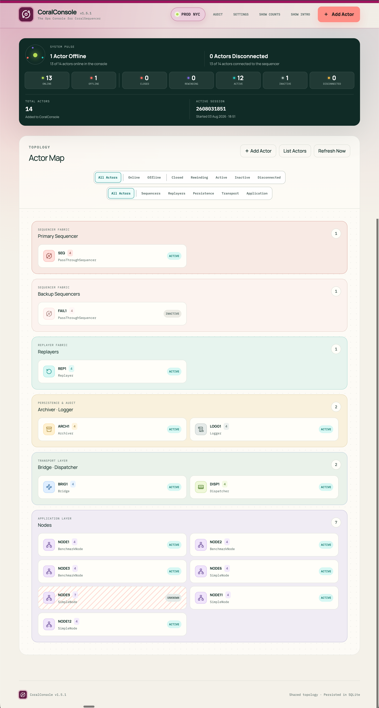

<p align="center">
  
</p>

# CoralConsole

CoralConsole is a web-based operations console for discovering, organizing, and administering actors within a [CoralSequencer](https://www.coralblocks.com/coralsequencer) distributed system.
It gives operators one live view of every actor, its connectivity, operational
state, last log messages, and available REST admin actions.



## Purpose

[CoralSequencer](https://www.coralblocks.com/coralsequencer) systems are composed of a
central Sequencer and surrounding actors such as Backup Sequencers, Replayers,
Archivers, Loggers, Bridges, Dispatchers and Nodes.
CoralConsole discovers those processes, organizes them by role, monitors them,
and provides a single place for operators to inspect and administer the
deployment.

## Features

- Live System Pulse with Online, Offline, Closed, Rewinding, Active, Inactive,
  and Disconnected counts.
- Filterable Actor Map organized by system layer and actor type.
- Automatic actor discovery from a host/IP address and REST admin port.
- Server-side monitoring over a dedicated persistent connection for each actor.
- One home-page browser refresh request retrieves current information for the
  complete topology, regardless of the number of actors.
- Dedicated actor pages with complete status fields and manual REST admin
  actions.
- Recent actor log messages update automatically on each Actor Detail page.
- Actor registry with endpoint editing, removal, and persisted precedence
  ordering within each actor type.
- Protected, searchable audit history for manual actions, including outcome,
  duration, output, timestamp, and requester IP address for accountability.
- Persistent topology settings, configurable polling, audit retention, and
  actor count visibility.
- Clear stale-interface warnings when the browser loses contact with the
  CoralConsole server.
- SQLite persistence, a verified backup script that runs without stopping
  CoralConsole, portable actor-only CSV import/export, and Docker deployment.

## How It Works

The browser communicates only with the CoralConsole server. At each UI refresh
interval, the home page makes one HTTP request for the complete topology. It
never sends one request per actor and never contacts actor REST endpoints
directly.

Separately, the server monitors every actor at the configured actor polling
interval. For each actor, it calls `actorStatus` to update connectivity and
operational state and retrieves recent actor logs over a dedicated persistent
connection.

The browser and server timers are independent, but server-side throttling
consolidates their work. A browser refresh receives the current stored topology
with fresh actor data. Multiple browser tabs do not multiply
actor polling.

When an actor is added, the server contacts its endpoint to discover its
identity, role, and actions before saving it. Manual admin actions use separate
one-shot connections and are recorded in the audit history.

One CoralConsole installation owns one topology and one database. Every browser
connected to that installation sees the same actors and settings.

## Installation

Docker Engine and Docker Compose v2 are required.

1. Download the package matching the Linux server architecture from the GitHub
   Release: `coralconsole-A.B.C-linux-amd64.tar.gz` for x86-64 or
   `coralconsole-A.B.C-linux-arm64.tar.gz` for ARM64. Do not use GitHub's
   automatic **Source code** archives.
2. Extract it and enter the installation folder:

   ```bash
   tar -xzf coralconsole-A.B.C-linux-amd64.tar.gz
   cd coralconsole-A.B.C
   ```

3. Run the installer:

   ```bash
   ./install.sh
   ```

Follow the prompts to choose the bind address and ports. The defaults make
CoralConsole available at `http://<server-address>:3000` on the local network.

## Operational Scripts

- `./scripts/docker-stop.sh` stops CoralConsole while preserving its database.
- `./scripts/docker-start.sh` starts CoralConsole from the existing local image
  without rebuilding it.
- `./scripts/change-config.sh` updates the installed network and access settings,
  using the current `.env` values as defaults.
- `./scripts/build-site.sh` builds the current source into the local image
  without starting, stopping, or replacing the running containers.
- `./scripts/docker-release.sh` builds the current source and deploys the new
  local image while preserving the database.
- `./scripts/docker-backup.sh` creates and verifies an online database backup
  in `backups/` without stopping CoralConsole. CoralConsole must be running.

## Export and Import Actors

Export actors from one CoralConsole installation and import them into another:

```bash
./scripts/actors-export.sh coralconsole-actors.csv
./scripts/actors-import.sh coralconsole-actors.csv
```

This is useful when installing a fresh CoralConsole version or keeping a handy
CSV list of configured actors. Import requires an installation with no actors.

## Network and Access Protection

CoralConsole can add either or both of two lightweight protections during
installation. An ingress allowlist limits connections to selected IPv4 or IPv6
addresses and CIDR ranges, while an optional shared access key places a simple
gate in front of every page and API, except the health check. Both are off by
default.

The access key is shown once by the installer; only its hash is kept in `.env`.
It creates a signed, HttpOnly browser session and is shared by all operators. No
usernames or roles are involved. The audit log records the source IP of the requests.

## License

Licensed under the [Apache License 2.0](./LICENSE).
